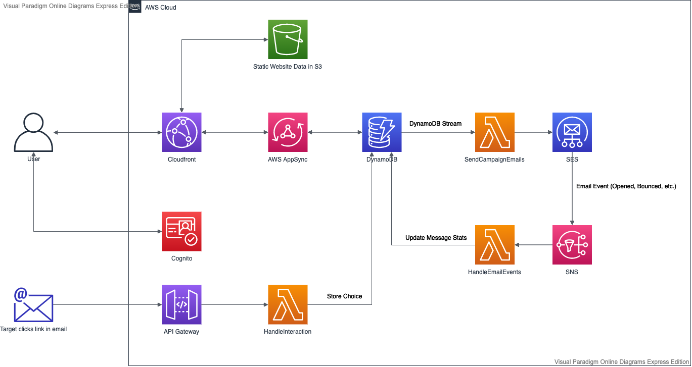

# <span style="margin-right:10px">👨🏻‍✈️</span> Mister Mail

Friendly mass mailer.

## Architecture

As is the nature with architecture diagrams, expect this to be either aspirational or horribly out-of-date.

<a href="https://drive.google.com/file/d/12FSTrMZs5HWeGkN_7h481OHAxGHd0cRv/view?usp=sharing">
</img>
</a>

## Setup

```bash
> npm install
```

## Deploy

1. To deploy the application, simply run this command in the project root.

```bash
> npm run deploy
```

2. Next, initialize amplify in the `services/web-client` folder.

```bash
> amplify init
```

3. Associate the app with your API.

```bash
> amplify add codegen --apiId <API_ID_HERE>
```

The API ID is available at https://console.aws.amazon.com/appsync/home?region=us-east-1.

Any time we modify the schema, we can re-generate the types by running `amplify codegen` inside the `services/web-client` folder.

## Development

### Validate changes to the GraphQL schema

```bash
npm run appsync:validate
```

### Manual Sign-up

This is how you can create a new user via the AWS CLI.

```bash
aws cognito-idp sign-up \
  --client-id <CLIENT ID> \
  --username bob@gmail.com \
  --password password

aws cognito-idp admin-confirm-sign-up \
  --user-pool-id <USER POOL ID> \
  --username bob@gmail.com
```

## Troubleshooting

### Log Group already exists

This project is using custom resources to set up the SES event destination. (SNS event destinations are not supported by Cloudformation)
But the log group of the Lambda function is not cleaned up automatically. This can lead to the following error when deleting and re-creating the stack.

```
  Serverless Error ---------------------------------------

  An error occurred: ConfigureSesEventsLogGroup - /aws/lambda/mister-mail-dev-ConfigureSesEvents already exists.
```

The solution is easy enough.

- Go to the [Cloud Watch log groups page](https://console.aws.amazon.com/cloudwatch/home#logs:)
- Select your region
- Select the log group mentioned in the error messsage
- Click **Actions -> Delete log group**

## DynamoDB Schema

| PK          | SK           | Content                                                 |
| ----------- | ------------ | ------------------------------------------------------- |
| U-userId    | C-campaignId | name, destinations, email stats and other campaign info |
| M-messageId | mail         | user id, campaign id, message status                    |

In case you are wondering why the mails are not in the user partition: I am too lazy to send raw emails just to attach a custom header containing the required info.
If user and campaign would be included in the email event, it would save an additional Lambda invocation that updates the campaign stats and make life sparkly and wonderful.

### Access Patterns

| Get           | By                        | Using              |
| ------------- | ------------------------- | ------------------ |
| All campaigns | User Id                   | Query PK+SK prefix |
| Campaign      | User Id + Campaign Id     | Query PK+SK        |
| Message       | Campaign Id + Destination | ???                |

The last access pattern is not currently supported. I.e. you can't see which email was opened / bounced etc. Obviously that doesn't make sense! It's a work in progress.
