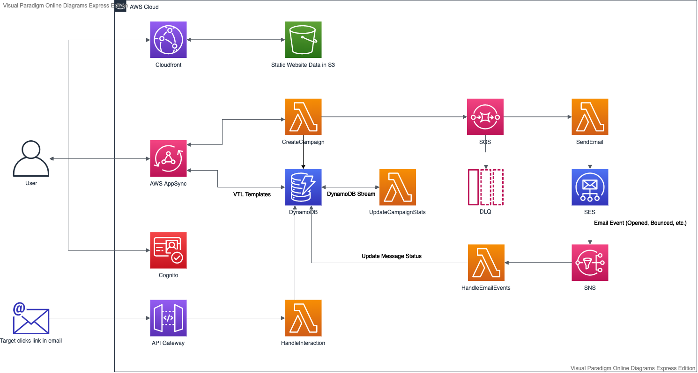

# <span style="margin-right:10px">👨🏻‍✈️</span> Mister Mail

Friendly mass mailer.

## Architecture

As is the nature with architecture diagrams, expect this to be either aspirational or horribly out-of-date.

<a href="https://drive.google.com/file/d/12FSTrMZs5HWeGkN_7h481OHAxGHd0cRv/view?usp=sharing">
</img>
</a>

## Setup

```bash
> npm install
```

## Deploy

1. To deploy the API, simply run this command in the project root.

```bash
> npm run deploy:api
```

2. Next, initialize amplify in the `web-client` folder.

```bash
(web-client) > npm run amplify:init
```

3. Find your API id using the AWS CLI.

```bash
(web-client) > aws appsync list-graphql-apis
```

4. Associate the app with your API.

```bash
(web-client) > amplify add codegen --apiId <API_ID_HERE>
✔ Getting API details
Successfully added API AppSync-mister-mail-api-dev to your Amplify project
? Choose the code generation language target **typescript**
? Enter the file name pattern of graphql queries, mutations and subscriptions **src/graphql/**/*.ts**
? Do you want to generate/update all possible GraphQL operations - queries, mutations and subscriptions **Yes**
? Enter maximum statement depth [increase from default if your schema is deeply nested] **2**
? Enter the file name for the generated code **src/graphql/types.ts**
? Do you want to generate code for your newly created GraphQL API **Yes**
✔ Downloaded the schema
✔ Generated GraphQL operations successfully and saved at src/graphql
✔ Code generated successfully and saved in file src/graphql/types.ts
```

5. Fill in the `config.js` values using the exports from Cloudformation you can retrieve via the AWS CLI.

```bash
(web-client) > aws cloudformation list-exports
(web-client) > cp src/config.example.js src/config.js
```

Use your editor of choice to fill in the values.

```js
export const config = {
  identityPoolId: 'us-east-1:XXXXXXXXXX',
  userPoolId: 'us-east-1_XXXXXXXXXX',
  userPoolWebClientId: 'XXXXXXXXXX',
};
```

6. Lastly deploy the client

```bash
(web-client) > npm run deploy
```

This will create the required resources, build the project and upload it to S3. You can find the URL of your CloudFront distribution via the AWS CLI.

```bash
> aws cloudfront list-distributions --query "DistributionList.Items[*].{DomainName:DomainName}"
```

## Development

### Validate changes to the GraphQL schema

```bash
(backend) > npm run appsync:validate
```

Any time we modify the schema, we can re-generate the types for the client application by running `amplify codegen` inside the `services/web-client` folder.

### Remove Amplify API association from web-client

In case you re-created the API, you need to remove the old API before associating the new one.

```bash
(web-client) amplify codegen remove
```

### Manual Sign-up

This is how you can create a new user via the AWS CLI.

```bash
aws cognito-idp sign-up \
  --client-id <CLIENT ID> \
  --username bob@gmail.com \
  --password password

aws cognito-idp admin-confirm-sign-up \
  --user-pool-id <USER POOL ID> \
  --username bob@gmail.com
```

## Troubleshooting

### Log Group already exists

This project is using custom resources to set up the SES event destination. (SNS event destinations are not supported by Cloudformation)
But the log group of the Lambda function is not cleaned up automatically. This can lead to the following error when deleting and re-creating the stack.

```
  Serverless Error ---------------------------------------

  An error occurred: ConfigureSesEventsLogGroup - /aws/lambda/mister-mail-dev-ConfigureSesEvents already exists.
```

The solution is easy enough.

```sh
> aws logs delete-log-group --log-group-name "/aws/lambda/mister-mail-dev-ConfigureSesEvents"
```

## DynamoDB Schema

| PK     | SK                     | Content                                                 |
| ------ | ---------------------- | ------------------------------------------------------- |
| userId | C#campaignId           | name, destinations, email stats and other campaign info |
| userId | M#campaignId#messageId | user id, campaign id, message status                    |

### Access Patterns

| Get                  | By                                | Using                |
| -------------------- | --------------------------------- | -------------------- |
| All campaigns        | User Id                           | Query PK + SK prefix |
| Campaign             | User Id + Campaign Id             | Query PK + SK        |
| Messages by campaign | User Id + Campaign Id             | Query PK + SK prefix |
| Message              | User Id + Campaign Id + MessageId | Query PK + SK        |
